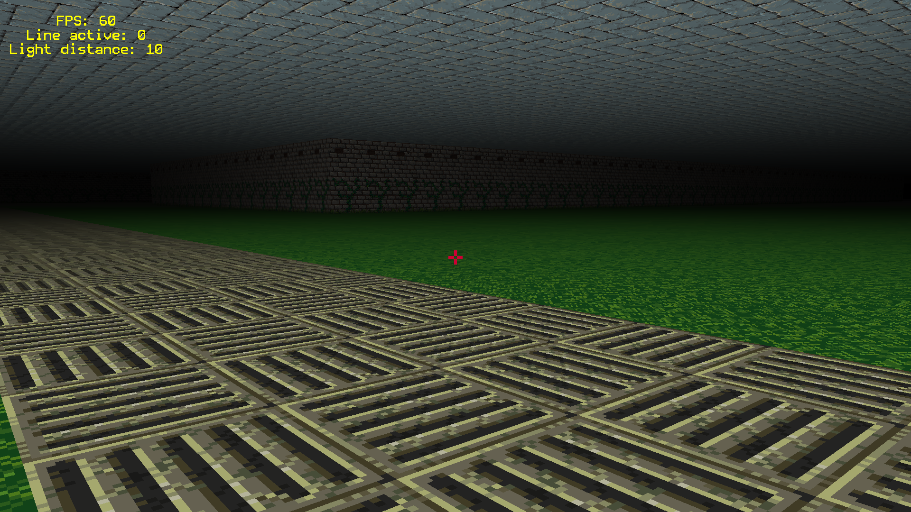

# A simple 3D game

Combining raycasting (to find which tiles to render) with ordinary GPU rendering.

Texture source: https://little-martian.itch.io/retro-texture-pack
Map generated using: https://www.mazegenerator.net/

# Screenshots
## January, 2nd, 2024

# TODO for this version

- Optimize text rendering. (Make a marker variable for highlighted text so the shader doesn't need to check the fragment position each time. Input the marker to Vertex shader).
- Make a GUI struct and module, add methods for button and slider.
- Put a single quad mesh generation in a separate function to optimize mesh module.
