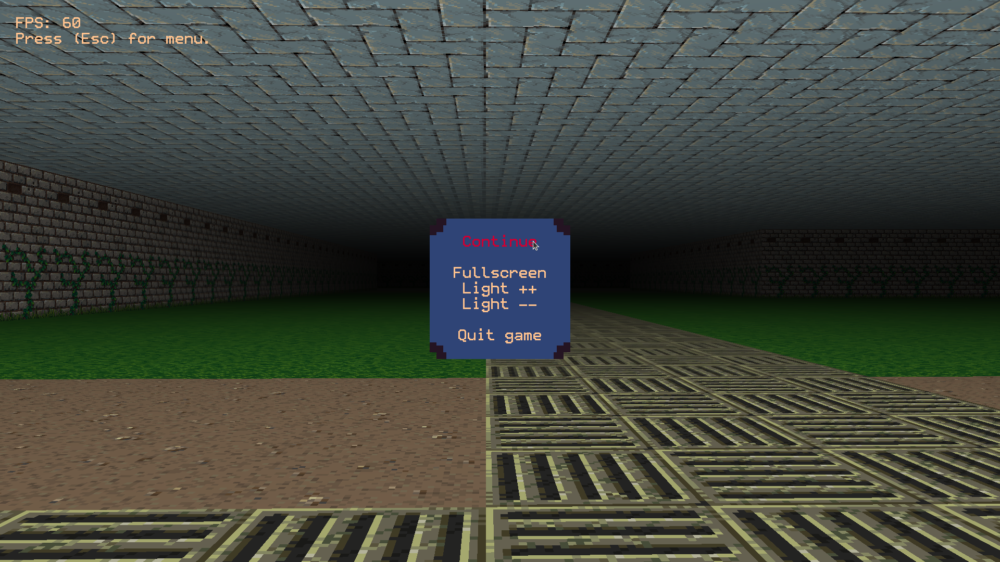

# A simple 3D game

Combining raycasting (to find which tiles to render) with ordinary GPU rendering.

Texture source: https://little-martian.itch.io/retro-texture-pack

Map generated using: https://www.mazegenerator.net/

Font is a heavily edited version of https://datagoblin.itch.io/monogram

# Screenshots
## January, 3rd, 2024

## January, 2nd, 2024

# TODO for this version

- Improve GUI, add proper buttons and sliders.
- Put a single quad mesh generation in a separate function to optimize mesh module.
- Add sprites. First static, then animated.
- Add light sources and light map.
- Add save system.
- Add physics.