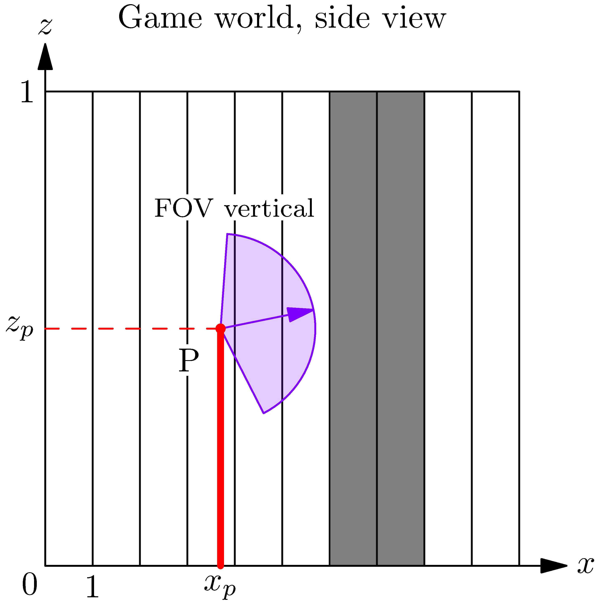
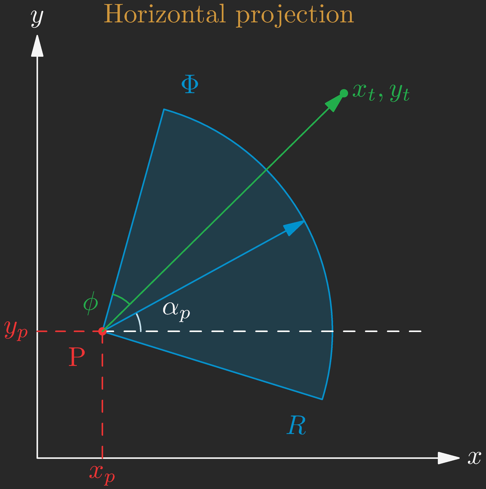
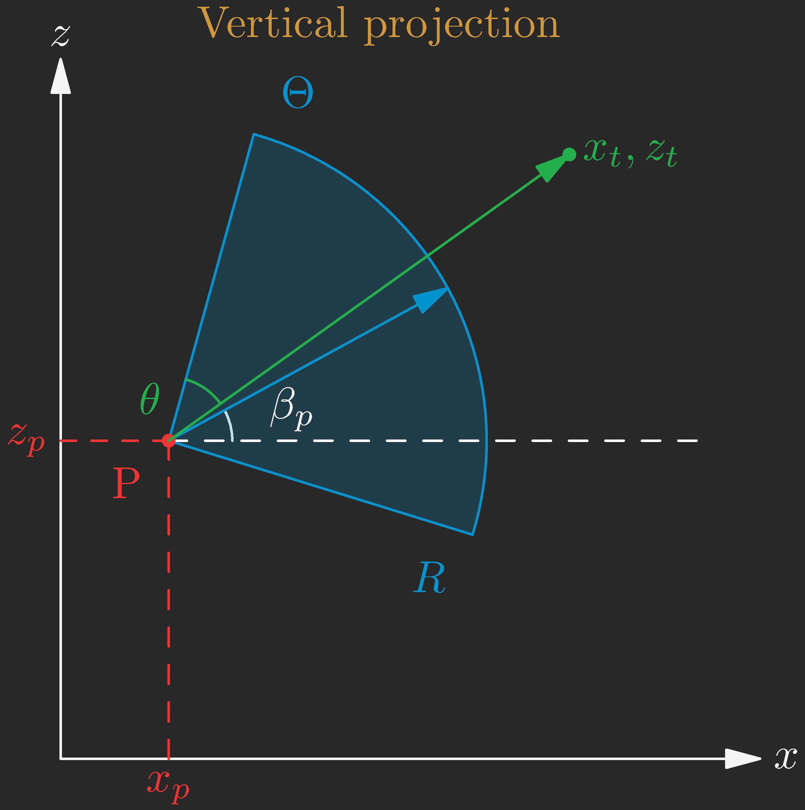

<!-- 
_class: "lead"
_footer: " "
-->

## My Game 2024

### December 2023 notes

---

# What kind of game do I want?
### Genre

Fantasy RPG, survival?

### Rendering
- First person pseudo 3D
- Huge 2D map (open world? procedural? some mix of everything)
- Pixel art (2D sprites/textures for everything)
- Can switch between 2D and 3D at any time
- Engine-agnostic (optimized for all GPU's, possibility of CPU software rendering)
- Customizable/moddable?

---

# January goals

### Create the engine

- Map/level editor. Load maps from image files? Pixel color = texture.
- Render map (raycasting, but with full quad GPU rendering, not stripes)
- Walls rendered as quads, floor/ceiling as quads too (more customizeable)
- Switch between fully 2D top-down / fully 3D view
- Sky texture. Day/night cycle. 2D lighting?
- Render animated sprites

Use **SFML**, Raylib?

---

# Raycasting walls

- Launch 2D rays from camera
- First launch to the centers of closest tiles, then further and further
- If no collisions, draw wall/ceiling quads
- If collision, draw wall quad
- Quads are drawn by projecting their corners to the camera

---

&nbsp;&nbsp;&nbsp;&nbsp;&nbsp;&nbsp;

---

<!-- 
_class: columns
-->

$$R = \frac{W}{\Phi}, \quad W - \text{screen width}$$

$$u=R \phi = W \frac{\phi}{\Phi}  \in [0,W]$$

$$d_{xy} = \sqrt{(x_t-x_p)^2+(y_t-y_p)^2}$$

$$\alpha_t = \operatorname{sign} (y_t-y_p) \operatorname{acos} \frac{x_t-x_p}{d_{xy}}$$

$$\phi = \frac{\Phi}{2} + \alpha_p - \alpha_t$$

$$u = \frac{W}{\Phi} \left(\frac{\Phi}{2} + \alpha_p - \alpha_t \right)$$

---

<!-- 
_class: columns
-->

$$\Theta = \frac{H}{W} \Phi$$

$$v=R \theta = H \frac{\theta}{\Theta}  \in [0,H]$$

$$d = \sqrt{(x_t-x_p)^2+(y_t-y_p)^2+(z_t-z_p)^2}$$

$$\beta_t = \frac{\pi}{2} - \operatorname{acos} \frac{z_t-z_p}{d}$$

$$\theta = \frac{\Theta}{2} + \beta_p - \beta_t$$

$$v = \frac{H}{\Theta} \left(\frac{\Theta}{2} + \beta_p - \beta_t \right)$$